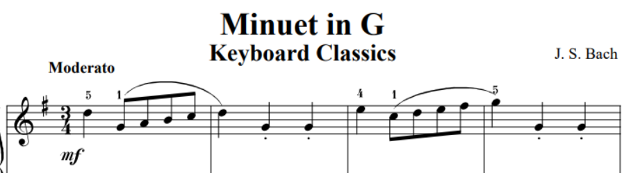
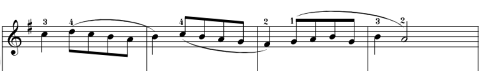

# Buzzer volume controlled by potentiometer with musical loop

## Overview

This program plays 8 bars of the minuet in g from Bach with the volume being controlled by a potentiometer. Additionnally, the led turns on when a note is played and when the button is pressed, the same music will play but an octave higher. 

## Components

- Buzzer
- Button
- Potentiometer 
- Led

## Circuit diagram

Here are the connections:

- Potentiometer connected to ADC0
- Buzzer connected to PIN D20
- LED connected to PIN D16
- BUTTON connected to PIN D18 

## Program

The program will go through an array of values representing frequencies and the buzzer will resonate at those frequencies for a given time. In the same for loop, it reads the ADC0 value from the potentiometer to ajust the desired volume. Finally, when the button is pressed, the selected array of notes will switch to the other (the same array but each frequency is multiplied by two) and vice versa.

## Addtionnal features

- Led turns on when a note is played and off briefly before the next note is played
- When the button is pressed, the music will switch between the piece being played at G6 to G7